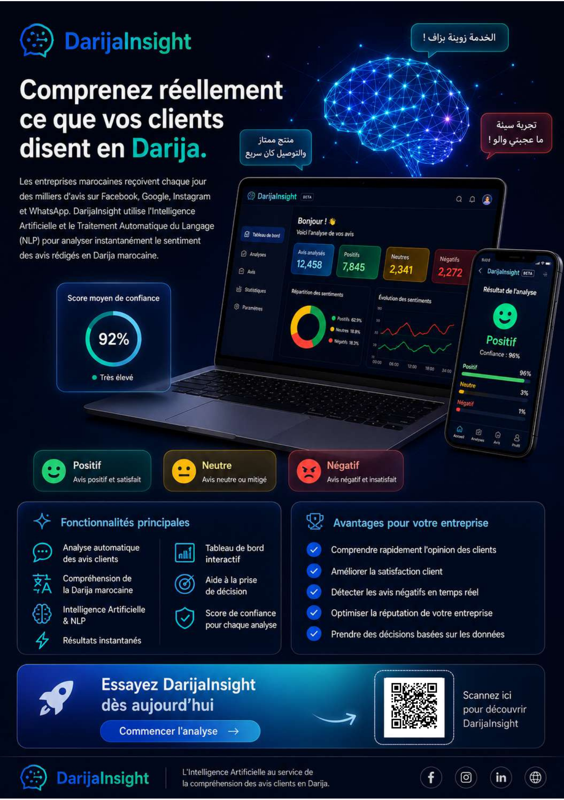
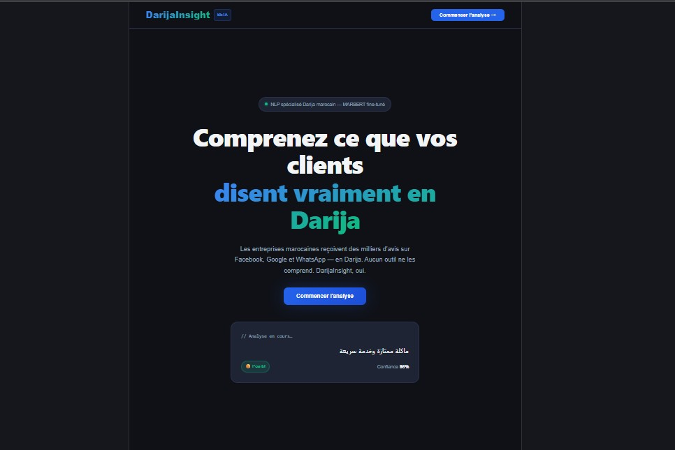
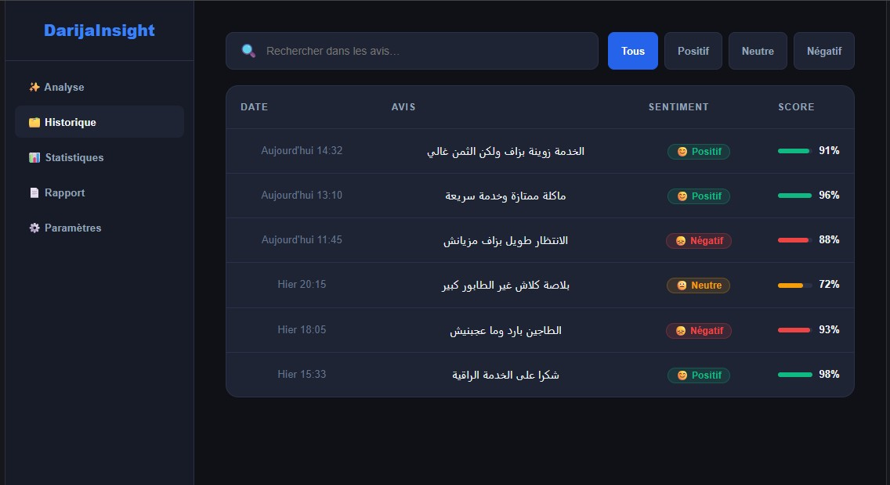
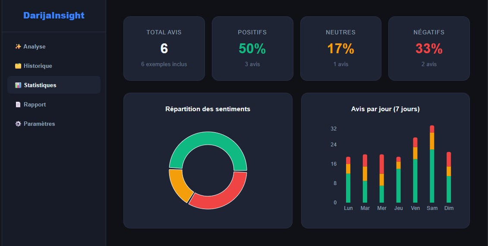

# 🇲🇦 DarijaInsight

**DarijaInsight** is an AI-powered platform that helps Moroccan businesses automatically analyze customer reviews written in Moroccan Darija.

The project combines **Natural Language Processing (NLP)**, **Deep Learning**, and a fine-tuned **MARBERT** model to classify customer opinions into **Positive**, **Neutral**, or **Negative** sentiments. The goal is to transform unstructured customer feedback from social media and online platforms into actionable business insights.

Beyond sentiment prediction, DarijaInsight provides an interactive web dashboard that enables companies to visualize customer feedback, monitor satisfaction trends, and support strategic decision-making in real time.

---

# 🎯 Project Objectives

This project was developed to address the lack of NLP solutions dedicated to the Moroccan Darija language. Its main objectives are:

- Automatically analyze customer reviews written in Moroccan Darija.
- Classify reviews into **Positive**, **Neutral**, or **Negative** sentiments.
- Provide prediction confidence scores for every analyzed review.
- Store and manage prediction history.
- Visualize customer satisfaction through interactive dashboards.
- Help companies better understand customer opinions and improve decision-making.

---

# 📌 Project Flyer

The flyer below summarizes the motivation behind the project, its objectives, the proposed AI solution, the main application features, and the business value of DarijaInsight.

  

---

# 🖥️ Interactive Dashboard

DarijaInsight includes a modern and user-friendly dashboard that allows businesses to analyze customer reviews, monitor sentiment evolution, and explore valuable insights generated by the AI model.

---

## 🔹 Home Page

The landing page introduces the platform and provides a simple interface where users can submit customer reviews written in Moroccan Darija for instant sentiment analysis.

  

The analysis returns:

- Predicted sentiment
- Confidence score
- Real-time AI inference
- Simple and intuitive user experience

---

## 🔹 Review History

Every analyzed review is automatically saved in the system.

Users can browse previous analyses, search for specific reviews, filter results by sentiment, and quickly access prediction confidence scores.

  

This module facilitates customer feedback management and makes historical analyses easily accessible.

---

## 🔹 Statistics Dashboard

The statistics page provides an overall view of customer opinions through interactive charts and summary indicators.

  

The dashboard includes:

- Total number of analyzed reviews
- Positive, Neutral, and Negative percentages
- Sentiment distribution
- Daily sentiment evolution
- Visual analytics to support business decisions

---

# 📈 Key Features

- Automatic sentiment analysis for Moroccan Darija.
- Fine-tuned MARBERT language model.
- Real-time inference with confidence scores.
- Review history and filtering system.
- Interactive statistics dashboard.
- Business-oriented interface for customer feedback analysis.
- Fast and intuitive web application.

---

# 💡 Business Value

DarijaInsight enables organizations to better understand customer opinions expressed in Moroccan Darija and transform them into meaningful insights.

The platform helps companies to:

- Monitor customer satisfaction in real time.
- Quickly identify negative feedback.
- Detect satisfaction trends.
- Improve products and services based on customer opinions.
- Make faster, data-driven business decisions.
- Reduce the manual effort required for customer feedback analysis.

---

